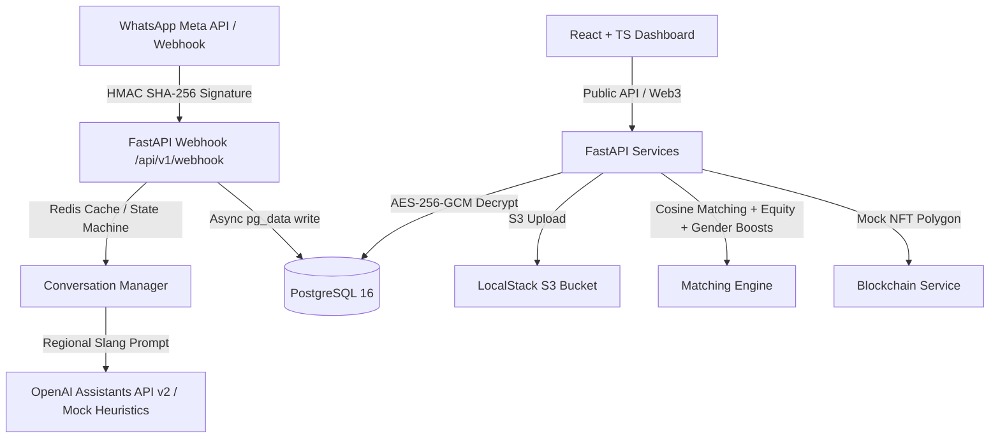

# DigitalIA — Conversational Micro-learning & Sovereign Gig Matching for Vulnerable Youth

[](https://github.com/lekosarmento/digitalia)
[](https://github.com/lekosarmento/digitalia)
[](https://github.com/lekosarmento/digitalia)
[](LICENSE)
[](https://fundinnovation.dev)

**DigitalIA** is an innovative conversational mobile learning and sovereign employment platform designed to equip vulnerable youth aged 16 to 30 in peripheral communities of the Brazilian Northeast with high-demand digital skills directly via WhatsApp, and instantly connect them to the gig economy via an algorithmic-equity B2B marketplace.

Developed by the proponent organization **Vertekia** under the technical leadership and responsibility of director **José Werkley Sarmento Dias** as an official proposal for the **Fund for Innovation in Development (FID)** Stage 0 Prepare Grant (€50,000).

---

## 🌟 Visual Architecture



---

## 🚀 Key Technological Features (Senior-Level Engineering)

1. **Friction-Free WhatsApp micro-learning**:
   Deliver assynchronous micro-learning lessons directly inside WhatsApp (99% penetration in Brazil). Integrates OpenAI's **GPT-4o** with the localized, empathetic regional chatbot persona **Mandacaru** (communicating in the warm, resilience-symbolizing Northeast dialect) to reduce MOOC attrition.
2. **Audio-Based Accessibility (Whisper Integration)**:
   Integrates **OpenAI Whisper** to transcribe voice notes into text. Youth with low written literacy can submit homework orally, which is graded in real-time by the cognitive engine.
3. **Algorithmic Justice & Gender Boost**:
   A cosine similarity matching engine in Python mapping 8 profile dimensions. Features an automated **+15% Equity Boost** for beginners bidding on low-complexity tasks, and a **+10% Gender Equity Boost** (cumulative, yielding **+25%** for female beginners) for young women, actively fighting the 4pp female youth unemployment disparity in the Northeast (15.4% vs 11.4%, IBGE 2025).
4. **Web3 Immutable Resume & Pix Routing**:
   Graduating students receive automatically hosted portfolios. Verified proof of work and ratings are minted as ERC-1155 tokens on the Polygon blockchain (using IPFS metadata). Small businesses pay instantly via Pix, routing **70% of the funds** directly to the student and **30%** to the platform for operational sustainability.
5. **Strict LGPD Compliance (Privacy by Design)**:
   Secures PII with symmetric **AES-256-GCM encryption**, indexes records using anonymous **SHA-256 hashing**, enforces a strict under-18 parental consent lock (LGPD Art. 14), and purges active session history after 2 years.

---

## 🛠️ Local Development & Quick Start

The entire DigitalIA MVP ecosystem is fully containerized with Docker Compose (FastAPI, Postgres 16, Redis 7.2, Celery, LocalStack S3).

### 1. Prerequisites
Ensure you have [Docker Desktop](https://www.docker.com/products/docker-desktop/) and [Git](https://git-scm.com/) installed on your machine.

### 2. Clone and Start Services
```bash
git clone https://github.com/lekosarmento/digitalia.git
cd digitalia/digitalia
docker compose up --build -d
```
All six containers (`digitalia_api`, `digitalia_postgres`, `digitalia_redis`, `digitalia_celery_worker`, `digitalia_celery_beat`, `digitalia_localstack`) will start up and run healthily.

### 3. Run Database Migrations
Deploy the 9 relationally connected tables versioned with Alembic into the active Postgres instance:
```bash
docker exec -it digitalia_api alembic upgrade head
```

### 4. Run Automated Pytests
Execute all unit tests (validating skill similarity, beginner equity boosts, senior penalties, and the young women gender boost):
```bash
docker exec -e PYTHONPATH=/app -t digitalia_api pytest -v
```
You should see: `4 passed in 1.79s`.

### 5. Simulate Conversational WhatsApp Journey
Simulate the regional Northeast chatbot onboarding, terms acceptance, lesson dispatch, and portfolio generator task:
```bash
docker exec -e PYTHONPATH=/app -t digitalia_api python app/learning/test_script.py
```

---

## 📂 FID Submission Deliverables

We have prepared and structured all required files for submission to the FID AFD online portal inside this repository:

*   **[`FID_PORTAL_TEXTS.md`](../FID_PORTAL_TEXTS.md)**: English texts optimized and calculated to respect strict character counts for the online forms (Short Description, Development Challenge, Innovation, Progress, Gender/Climate, and Theory of Change narrative).
*   **[`FID_BUDGET_ACTIVITIES.csv`](../FID_BUDGET_ACTIVITIES.csv)**: Activity-based budget (€50,000 over 6 months) ready for Excel application mapping.
*   **[`diagrama_teoria_mudanca.png`](../diagrama_teoria_mudanca.png)**: Visual Infographic of the Theory of Change causal links (1200x800px) with assumptions.
*   **[`presentation_pitch.html`](../presentation_pitch.html)**: Interactive McKinsey/BCG Obsidian-styled HTML Pitch Presentation.
*   **[`final_delivery_report.md`](../final_delivery_report.md)**: Final Delivery Report & Systems Governance log.

---

## 📄 License

This project is licensed under the MIT License - see the [LICENSE](LICENSE) file for details.

---

## 🤝 Partners & Institutional Framework

*   **Federal University of Paraíba (UFPB Virtual & CCSA/Economics)** — Independent Quasi-Experimental Evaluator (Waitlist Control Group).
*   **SEBRAE-PB** — Small Business pipeline and project marketplace validation partner.
*   **SEDES (Prefeitura de João Pessoa)** — Territorial community access and facilitation support.
*   **Instituto Aliança** — National pedagogical reference for youth employability curricula.
*   **Polo de Inovação de João Pessoa** — Operational host.
