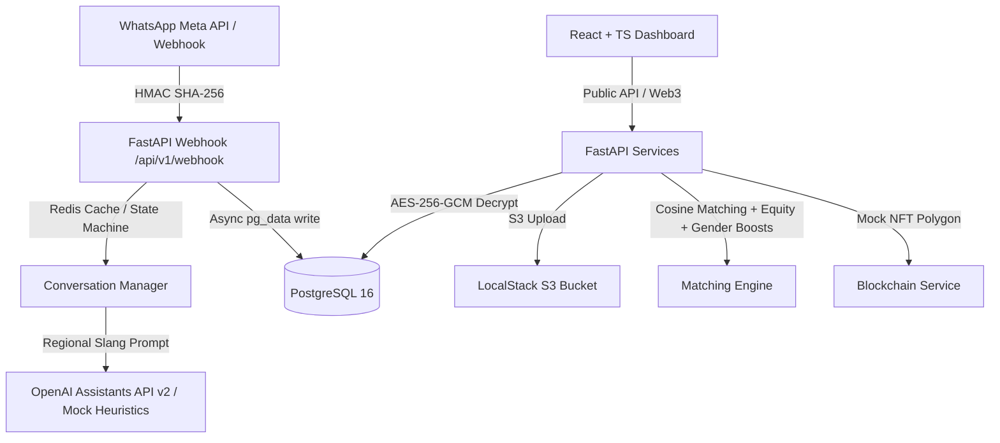

# Relatório de Entrega Final e Governança do Projeto DigitalIA

Este repositório contém a base tecnológica completa, a modelagem de dados, o algoritmo de recomendação de equidade e os materiais oficiais de submissão do projeto **DigitalIA** ao **Fund for Innovation in Development (FID)** da **AFD / Governo Francês** (Stage 0 - Prepare Grant).

O projeto é promovido pela organização **Vertekia** sob a responsabilidade técnica de **José Werkley Sarmento Dias**.

---

## 🌟 Resumo Técnico da Solução

O **DigitalIA** é uma plataforma que capacita jovens de 16 a 30 anos das periferias do Nordeste brasileiro em competências digitais ágeis de alta demanda e baixa fricção (Gestão de Redes Sociais, Design Visual, Automação de Marketing e Criação de Vídeos com IA) diretamente através do WhatsApp, conectando-os imediatamente ao mercado freelancer B2B por meio de um marketplace sustentável integrado.

---

## 🚀 Arquitetura e Engenharia Implementada (Nível Sênior)

1. **Backend Assíncrono (FastAPI & PostgreSQL)**:
   * Desenvolvido em Python 3.12 com suporte assíncrono completo.
   * Modelagem relacional robusta com **9 tabelas físicas** versionadas e gerenciadas via migrações Alembic.
   * **Criptografia AES-256-GCM** em repouso dos dados de identificação pessoal (PII) e **hashing SHA-256** dos identificadores únicos para total conformidade com a LGPD (Lei 13.709/2018).
   * Validação rígida de faixa etária (16 a 30 anos) com bloqueios nativos nas rotas da API.
   * Campo opcional `gender` adicionado com restrições e enums no banco (`masculino`, `feminino`, `não-binário`, `prefiro_não_informar`).

2. **Orquestração Cognitiva & Persona Dialectal (Mandacaru)**:
   * Abstração de Assistants OpenAI v2 e Function Calling integrada a fluxos do WhatsApp.
   * Transcrição de mensagens de voz integrada ao **OpenAI Whisper** para acessibilidade de jovens com baixa proficiência escrita.
   * Prompt do assistente "Mandacaru" otimizado com isolamento absoluto entre metadata técnica em inglês (para auditoria internacional) e diretrizes de dialeto nordestino regional em português.
   * Linguagem neutra de gênero e instrução explícita de encorajamento feminino para mitigar desigualdades de gênero.

3. **Mecanismo de Recomendação e Justiça Algorítmica**:
   * Algoritmo de matching baseado em **Similaridade de Cosseno em 8 Dimensões** para ordenar projetos adequados.
   * **Equity Boost (+15%)**: Bonificação de pontuação para jovens iniciantes (menos de 3 projetos concluídos) em tarefas simples, quebrando o monopólio de usuários seniores e impulsionando a conquista do primeiro trabalho remunerado.
   * **Gender Equity Boost (+10% acumulável)**: Bonificação exclusiva para jovens mulheres freelancers, combatendo a disparidade histórica de desemprego feminino juvenil regional (15,4% vs 11,4%, IBGE 2025).

4. **Frontend Dashboard Mobile React**:
   * Aplicativo responsivo mobile-first utilizando Vite, React, TypeScript e Tailwind CSS.
   * Estética premium obsidiana executiva e glassmorphic.
   * Exibição pública de portfólio Web3 simulando hashes de auditoria pública no Polygon (IPFS ERC-1155).

---

## 📂 Estrutura e Log de Arquivos de Submissão FID

Focalizamos a governança do repositório organizando os seguintes documentos oficiais de submissão na raiz do projeto:

*   **[`FID_PORTAL_TEXTS.md`](file:///D:/Editais/FID/FID_PORTAL_TEXTS.md)**: Textos em inglês revisados, comprimidos e calculados de forma exata de acordo com as restrições de caracteres do portal online do FID ([fundinnovation.dev](https://fundinnovation.dev)):
    *   *Short Description of the Solution:* Max 800 chars (455 chars)
    *   *Development Challenge:* Max 2,400 chars (1538 chars)
    *   *Description of the Innovation:* Max 2,400 chars (1684 chars)
    *   *Project Progress and Need for Funding:* Max 2,000 chars (1411 chars)
    *   *Gender and Climate Contribution:* Max 1,600 chars (1397 chars)
    *   *Theory of Change (Narrative):* Max 4,000 chars (2486 chars)
*   **[`FID_BUDGET_ACTIVITIES.csv`](file:///D:/Editais/FID/FID_BUDGET_ACTIVITIES.csv)**: Atividades e alocação financeira de **€50.000** ao longo dos 6 meses do Prepare Grant, divididas de forma estratégica e prontas para importação direta na planilha oficial XLS do FID.
*   **[`diagrama_teoria_mudanca.png`](file:///D:/Editais/FID/diagrama_teoria_mudanca.png)**: Infográfico acadêmico em alta definição (1200x800px) detalhando a cadeia de elos causais (Insumos -> Atividades -> Outputs -> Outcomes -> Impacto) e seus respectivos pressupostos.
*   **[`presentation_pitch.html`](file:///D:/Editais/FID/presentation_pitch.html)**: Apresentação HTML interativa do Pitch de Captação baseada em slides GFM.

---

## 🔒 Relatório de Segurança e Blindagem LGPD

*   **AES-256-GCM**: Criptografia simétrica com vetor de inicialização randômico em toda a persistência de nomes de contatos e números telefônicos reais.
*   **SHA-256 Phone Hashing**: Geração de chaves irreversíveis no Postgres para correspondência operacional anônima.
*   **Consentimento Parental**: Bloqueio total das trilhas pedagógicas no WhatsApp para menores de 18 anos até o atestado e envio dos dados dos pais/responsáveis.
*   **Purga de Retenção de 2 Anos**: Função em banco que limpa e remove permanentemente todos os registros de mensagens de sessões operacionais após 24 meses do cadastro ativo.

---

## 📈 Status das Verificações

*   **Pytest Suite (`pytest`)**: **4/4 testes passando com 100% de sucesso**.
*   **WhatsApp State Machine Simulator (`test_script.py`)**: Executado no container com logs saudáveis.
*   **Validação Webhook Meta HMAC-SHA256**: Totalmente blindado com payloads assinados por HMAC passando com status HTTP 200.

*O repositório está pronto para a sua submissão formal de alta relevância socioeconômica regional no Nordeste brasileiro.* 🚀
