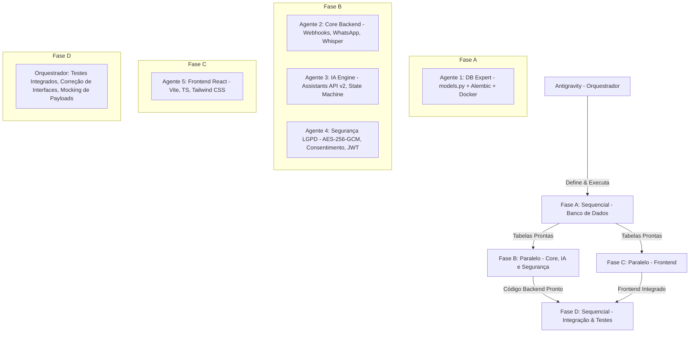

# Plano de Implementação Refinado — Projeto DigitalIA

O **DigitalIA** é uma plataforma inovadora de capacitação digital e empregabilidade para jovens de 16 a 30 anos de comunidades periféricas do Nordeste brasileiro. O sistema funciona primariamente via WhatsApp e um Web App leve para portfólios, matching e painel administrativo. 

Este plano estabelece a arquitetura detalhada e a estratégia de **orquestração de múltiplos agentes em paralelo** refinada com as valiosas diretrizes de produto e engenharia fornecidas.

---

## 🤖 Estratégia de Execução e Dependências

Para evitar gargalos de dependência de código (ex: importação de modelos inexistentes), a execução será organizada em **fases sequenciais e paralelas**:

### Papéis Detalhados dos Agentes e Fluxo de Trabalho

#### **Fase A: Sequencial (~1h)**
- **Agente 1 (`digitalia-db-expert`)**:
  - **Escopo**: Docker Compose (PostgreSQL 16, Redis 7.2, LocalStack para S3, Celery), configuração do banco assíncrono com SQLAlchemy (`models.py`) e migração inicial via Alembic.
  - **Entregável**: Banco de dados e infraestrutura rodando localmente no Docker com tabelas criadas.

#### **Fase B & C: Paralelo (~3h)**
- **Agente 2 (`digitalia-backend-core`)**:
  - **Escopo**: FastAPI, roteamento, endpoint de webhook, download de mídias, Whisper Service para transcrição de áudio, integração com LocalStack S3 (boto3 com `endpoint_url`).
  - **Entregável**: Estrutura de rotas operacionais e processamento assíncrono.
- **Agente 3 (`digitalia-ai-learning-engine`)**:
  - **Escopo**: OpenAI Assistants API v2 orquestração, máquina de estados do WhatsApp (`LearnerState`), Redis para controle de estados com TTL, e Function Calling do Assistant.
  - **Entregável**: Respostas do robô inteligentes e persistência de conversas.
- **Agente 4 (`digitalia-security-lgpd`)**:
  - **Escopo (Focado)**: LGPD puro. Criptografia AES-256-GCM transparente no banco de dados para campos PII (nome, telefone, conversas), lógica de consentimento para menores de 18 anos, autenticação JWT robusta, rate limit, e **Mock de Certificados** (gerando UUIDs imutáveis no banco simulando Polygon).
  - **Entregável**: Barreira de privacidade ativa e mock de certificados funcional.
- **Agente 5 (`digitalia-frontend-architect`)**:
  - **Escopo**: Dashboard web responsivo móvel em React/TypeScript com Tailwind CSS. Exibição de portfólios, progresso e cards de projetos.
  - **Entregável**: Interface frontend integrada.

#### **Fase D: Integração e Testes (Orquestrador)**
- **Nós (Parent)**: Atuaremos como integradores. Criaremos o script `/scratch/test_webhook_payload.py` para disparar payloads Meta simulados assinados com HMAC-SHA256, rodaremos os testes automatizados da matching engine, e resolveremos qualquer inconsistência de interface/importações entre módulos.

---

## 🛠️ Infraestrutura e Configurações Ajustadas

### Docker Compose (`docker-compose.yml`)
Incluirá os seguintes containers:
1. **`postgres`**: Imagem oficial v16.
2. **`redis`**: Imagem oficial v7.2 para controle de estado do chatbot.
3. **`localstack`**: Emulação do AWS S3 localmente para upload de portfólios.
4. **`web`**: Servidor FastAPI (desenvolvimento).
5. **`celery_worker`**: Processamento em segundo plano (geração de portfólios, pagamentos).

### Configuração de Ambiente (`.env`)
Geraremos um arquivo `.env` local com valores padrão estáveis de desenvolvimento:
- `SECRET_KEY` de 256 bits gerada via gerador seguro.
- Configuração do `endpoint_url` para o LocalStack (`http://localhost:4566`).
- OpenAI API Key a ser informada pelo usuário ou mockada em testes unitários.
- Meta webhook verify token seguro.

---

## 🗂️ Proposed Changes (Novos Arquivos a Criar)

Os arquivos serão criados na pasta de trabalho [digitalia](file:///D:/Editais/FID/digitalia) conforme a ordem das fases:

### [NEW] Fase A (Sequencial)
- #### [NEW] [docker-compose.yml](file:///D:/Editais/FID/digitalia/docker-compose.yml)
  PostgreSQL 16, Redis 7.2, LocalStack (S3) e Celery Worker.
- #### [NEW] [.env](file:///D:/Editais/FID/digitalia/.env)
  Arquivo de ambiente configurado de forma segura com chaves de desenvolvimento.
- #### [NEW] [requirements.txt](file:///D:/Editais/FID/digitalia/backend/requirements.txt)
  FastAPI, SQLAlchemy (async), Alembic, Pydantic, OpenAI, Cryptography, Httpx, Redis, Celery, Boto3.
- #### [NEW] [models.py](file:///D:/Editais/FID/digitalia/backend/app/models/models.py)
  Definição completa de tabelas SQLAlchemy com indexação correta.

### [NEW] Fase B & C (Paralelo)
- #### [NEW] [whisper_service.py](file:///D:/Editais/FID/digitalia/backend/app/services/whisper_service.py)
  Serviço de download e transcrição via Whisper OpenAI.
- #### [NEW] [webhook.py](file:///D:/Editais/FID/digitalia/backend/app/api/v1/routes/webhook.py)
  Webhook validando assinaturas HMAC SHA-256 contra payloads mock/reais da Meta.
- #### [NEW] [assistant_factory.py](file:///D:/Editais/FID/digitalia/backend/app/learning/assistant_factory.py)
  Criação dinâmica de assistentes na OpenAI e definição do Function Calling.
- #### [NEW] [conversation_manager.py](file:///D:/Editais/FID/digitalia/backend/app/learning/conversation_manager.py)
  Máquina de estados persistida no Redis.
- #### [NEW] [lgpd.py](file:///D:/Editais/FID/digitalia/backend/app/core/lgpd.py)
  Criptografia AES-256-GCM para dados em repouso e lógica de consentimento.
- #### [NEW] [matching_engine.py](file:///D:/Editais/FID/digitalia/backend/app/marketplace/matching_engine.py)
  Algoritmo de matching por similaridade por cosseno com boost de equidade.
- #### [NEW] [package.json](file:///D:/Editais/FID/digitalia/frontend/package.json)
  Configurações do Vite, React e Tailwind CSS.
- #### [NEW] [ProgressDashboard.tsx](file:///D:/Editais/FID/digitalia/frontend/src/components/ProgressDashboard.tsx)
  Dashboard visual leve, focado em dispositivos móveis.

### [NEW] Fase D (Integração)
- #### [NEW] [test_webhook_payload.py](file:///D:/Editais/FID/digitalia/scratch/test_webhook_payload.py)
  Script utilitário para envio de requisições assinadas para teste local do webhook.
- #### [NEW] [test_matching_engine.py](file:///D:/Editais/FID/digitalia/backend/tests/test_matching_engine.py)
  Testes automatizados do motor de recomendação inteligente.

---

## 🧪 Plano de Verificação Refinado

1. **Fase A (DB)**: Inicializar containers e rodar as migrations. Validar a criação física das tabelas no PostgreSQL.
2. **Fase B & C (Backend, IA, Seg, Front)**:
   - Rodar testes locais simulando criptografia LGPD (criptografar um telefone e verificar se no DB ele está ilegível).
   - Simular o fluxo da máquina de estados do chatbot por linha de comando ou webhook local.
3. **Fase D (Integração)**:
   - Disparar o script `test_webhook_payload.py` para injetar mensagens de teste no webhook FastAPI rodando localmente.
   - Testar o comportamento do LocalStack mockando o upload de uma imagem do portfólio.
   - Executar os testes automatizados com `pytest` na matching engine.
