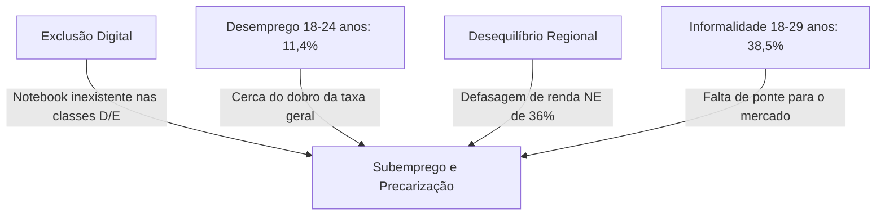
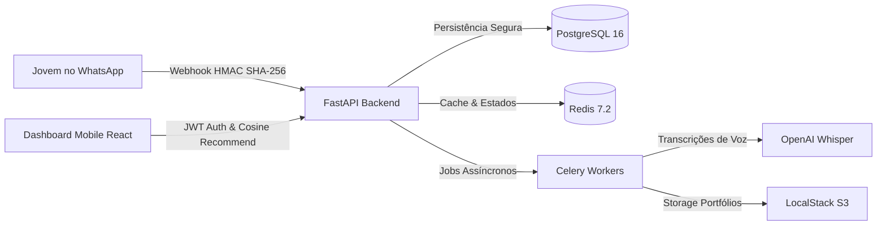

# Pitch Deck — DigitalIA: Capacitação Digital e Empregabilidade Social

Esta é a apresentação em formato de **Slides Carousel** alinhada estritamente com os critérios oficiais e dados analíticos da proposta submetida ao **Fund for Innovation in Development (FID)** pela proponente **Vertekia** sob a responsabilidade técnica de **José Werkley Sarmento Dias**.

Você pode navegar pelos slides abaixo de forma sequencial.

````carousel
# Slide 1: Capa
# DigitalIA
### Habilidades Digitais e Geração de Renda para a Juventude Periférica do Nordeste

---

> [!NOTE]
> **Proposta Oficial para o Fund for Innovation in Development (FID)**
> Proponente: Vertekia (João Pessoa, PB, Brasil)  
> Autor / Responsável Técnico: José Werkley Sarmento Dias  
> Estágio Pleiteado: **Prepare Grant (Estágio 0)** — até €50.000, com roadmap para Stage 1 (Piloto, até €200.000)

*   **Público-Alvo:** Jovens de 16 a 30 anos em situação de vulnerabilidade.
*   **Modelo de Negócio:** Marketplace B2B de micro-tarefas digitais com comissão autossustentável de 30% (70% repassados diretamente ao jovem).
*   **Diferencial Pedagógico:** Chatbot de bolso via WhatsApp com a persona dialectal **Mandacaru** (IA GPT-4o e transcrição Whisper).

*Bora arrochar e transformar realidades!* 🚀

<!-- slide -->
# Slide 2: O Diagnóstico Social
## O Nordeste em Números e a Exclusão Juvenil



### Indicadores Críticos (IBGE/FGV 2025):
1.  **Defasagem Estrutural:** Renda média mensal no Nordeste é de **R$ 2.282**, contra **R$ 3.560** da média nacional — um gap severo de 36% [IBGE, 2025].
2.  **Oportunidade Remota Freelance:** O rendimento médio mensal de profissionais digitais remotos atinge **R$ 6.479** (2,7x mais que presencial), mas falta a ponte de acesso.
3.  **Trabalho por Conta Própria:** O Brasil atinge **26,1 milhões** de autônomos (+2,4% vs. 2024) [IBGE, 2025], consagrando o mercado para micro-tarefas digitais.

<!-- slide -->
# Slide 3: A Solução
## Fricção Zero, M-Learning e Renda Imediata

### Educação Distribuída no Canal que Eles Já Usam: o WhatsApp (99% de penetração).

*   **Micro-Learning de Bolso:** Lições rápidas e objetivas consumindo dados móveis mínimos. Sem necessidade de notebooks ou downloads de apps pesados.
*   **Personagem Mandacaru:** Tutoria cognitiva com acolhimento regional nordestino ("oxente", "visse", "arretado"), o que ataca a evasão escolar e mantém o engajamento [Poornima et al., 2026].
*   **Ponte Concreta para a Renda:** A capacitação termina no primeiro projeto pago de PMEs locais no marketplace, com **70% do orçamento líquido** indo direto para o bolso do jovem.

> [!TIP]
> **Custo Marginal Baixo:** Custo total estimado por beneficiário de **R$ 80 a R$ 120**, uma fração do custo presencial do SENAC (R$ 800 - R$ 1.200).

<!-- slide -->
# Slide 4: As 4 Trilhas Pedagógicas
## Competências de Alta Demanda e Baixa Fricção

O jovem qualifica-se de forma prática em trilhas modulares curtas, em que cada exercício gera uma prova de trabalho para seu portfólio.

```
  [1. Gestão de Redes Sociais] ChatGPT, Canva, CapCut e Meta Business Suite
               │
               ▼
  [2. Design Visual com IA] Habilitação gráfica e Coolors IA
               │
               ▼
  [3. Automação de Marketing] Configuração de WhatsApp Business e Make/n8n
               │
               ▼
  [4. Criação de Conteúdo em Vídeo] Roteiros com ChatGPT e edição no CapCut Mobile
```

*   **Portfólio Automático:** A plataforma monta e hospeda automaticamente um site público contendo todas as peças reais produzidas nos exercícios, eliminando a barreira da falta de currículo tradicional.

<!-- slide -->
# Slide 5: A Tecnologia de Microsserviços
## Arquitetura Robusta, Segura e Escalável

Backend planejado com FastAPI assíncrono para suportar picos elevados de tráfego de webhooks do WhatsApp de forma reativa.



*   **Pilha de Produção:** FastAPI, PostgreSQL 16 (9 tabelas relacionais versionadas com Alembic), Redis 7.2 (TTL de 24h), Celery Workers + Beat, LocalStack (S3) e React + TypeScript.

<!-- slide -->
# Slide 6: Conformidade Estrita LGPD
## Privacidade por Concepção (Privacy by Design)

Tratamento de dados pessoais e proteção ativa de menores de idade em conformidade total com o Artigo 14 da LGPD.

```
                  Cadastro de Jovem via Chatbot
                                │
                                ▼
                   Idade informada pelo Usuário
                                │
          ┌─────────────────────┴─────────────────────┐
          ▼                                           ▼
      [Age < 18]                                 [Age >= 18]
          │                                           │
          ▼                                           ▼
Exige Consentimento Parental                   Exige Apenas Aceite
(Bloqueio até envio dos pais)                       do Usuário
          │                                           │
          └─────────────────────┬─────────────────────┘
                                │
                                ▼
         AES-256-GCM Criptografia Simétrica de PII no Banco
                        (Indexação por SHA-256)
```

*   **Ciclo de Retenção:** Dados e registros de conversas são armazenados por no máximo 2 anos, sendo física e permanentemente anonimizados/excluídos após esse período.

<!-- slide -->
# Slide 7: Algoritmo de Match com "Equity Boost"
## Recomendação Inteligente por Similaridade de Cosseno

O DigitalIA utiliza machine learning baseado em similaridade vetorial de **8 dimensões** para ordenar as melhores propostas de PMEs para cada perfil de egresso:

$$Vector = [Skills_{5d}, Hours_{1d}, Experience_{1d}, Rating_{1d}]$$

```
Similaridade por Cosseno Base ───► Se completed_projects < 3 E complexidade <= 3
                                              │
                                              ▼
                                   Equity Boost Social (+15%)
                                              │
                                              ▼
                                  Primeira Colocação no Ranking
```

### Por que isso é inovador?
*   **Equity Boost (+15%):** Jovens sem portfólio anterior recebem uma bonificação na visibilidade de projetos simples, resolvendo o paradoxo de "precisar de experiência para conseguir o primeiro trabalho".
*   **Comissão Justa:** Plataforma retém 30% da transação para custear a infraestrutura técnica e APIs de IA, gerando sustentabilidade financeira integral pós-grant.

<!-- slide -->
# Slide 8: Web3 e Reputação Imutável
## Emissão de Certificados e Hash Verificável

Conclusões de trilhas e avaliações positivas de projetos geram qualificações descentralizadas e seguras.

```
Conclusão de Trilha / Entrega de Projeto Aprovado
                        │
                        ▼
           Metadados arquivados no IPFS
                        │
                        ▼
 Cunhagem de Token ERC-1155 na Blockchain Polygon (Gas < R$ 0,01)
                        │
                        ▼
   Exibição do Hash de Auditoria Pública no Portfólio do Aluno
```

*   **Fricção Zero:** O jovem não precisa entender de criptomoedas ou carteiras digitais complexas. O DigitalIA gerencia o minting de forma transparente no backend e expõe a autenticidade para contratantes globais.

<!-- slide -->
# Slide 9: Orçamento Detalhado (Prepare Grant)
## Alocação Fiel e Custo-Efetividade de €50.000 (Stage 0)

| Rubrica | % | Valor (€) | Detalhamento Técnico |
| :--- | :--- | :--- | :--- |
| **Pessoal** | 60% | €30.000 | Coordenação do projeto, CTO backend sênior, desenvolvedor frontend e gestora comunitária. |
| **Infraestrutura técnica** | 15% | €7.500 | Hospedagem AWS, banco relacional Postgres, Redis e cotas de API OpenAI (GPT-4o/Whisper). |
| **Validação e M&E** | 10% | €5.000 | Coleta de survey de linha de base conversacional e desenho experimental de M&E junto à UFPB. |
| **Parcerias e Comunidade** | 10% | €5.000 | Articulação local e materiais de facilitação presencial de onboarding nas comunidades. |
| **Overhead e Gestão** | 5% | €2.500 | Contabilidade, compliance de submissão e contratação do auditor externo independente exigido pelo FID. |

<!-- slide -->
# Slide 10: Avaliação de Impacto e Teoria da Mudança
## O Rigor Científico com a UFPB CCSA/Economia

Para atender às exigências de evidência causal do FID, o monitoramento não baseia-se apenas em surveys descritivos "pré-pós" simples:

*   **Desenho Quasi-Experimental:** Grupo de Tratamento (usuários ativos) vs. **Grupo de Controle por Lista de Espera** (jovens equivalentes aguardando abertura de turmas). A lista de espera funciona como contrafactual eticamente viável.
*   **Avaliador Independente:** Parceria com o Departamento de Economia/CCSA da **UFPB** para analisar e publicar os dados de impacto trimestrais de forma imparcial.
*   **Linha de Base Conversacional:** Dados coletados automaticamente via WhatsApp antes da primeira lição pedagógica (renda familiar, status ocupacional, autoeficácia).

<!-- slide -->
# Slide 11: Alinhamento ODS e ESG
## Governança Corporativa e Compromissos Globais

```
                      Pilares de Impacto ESG
                                │
        ┌───────────────────────┼───────────────────────┐
        ▼                       ▼                       ▼
    [Ambiental]              [Social]              [Governança]
  Emissão zero de         Erradicação da         Conformidade LGPD
   papel e zero            pobreza (ODS 1)        rígida, auditorias
   deslocamento          e redução de gaps      periódicas e segurança
  (ensino móvel).       regionais (ODS 10).      de dados de menores.
```

*   **Alinhamento de ODS:**
    *   *ODS 1:* Erradicação da pobreza na base da pirâmide.
    *   *ODS 4:* Qualidade educacional móvel inclusiva.
    *   *ODS 8:* Trabalho decente, digital e de alta remuneração (média R$ 6.479).
    *   *ODS 10:* Inclusão algorítmica de equidade (*Equity Boost*).

<!-- slide -->
# Slide 12: Call to Action
## DigitalIA: Acelerando o Futuro da Juventude Nordestina

```
  [Investimento / Edital FID] 
               │
               ▼
 [Validação Piloto com 200 Jovens] (João Pessoa, PB)
               │
               ▼
[Rigor Metodológico & Contrafactual UFPB] 
               │
               ▼
 [Escala em 3 Cidades (5.000 Jovens)] (Ano 1) 🚀🏆
```

### O Futuro está Chamando.
O DigitalIA combina o cacto símbolo do sertão (Mandacaru) com o que há de mais avançado em IA pedagógica, engenharia de software e descentralização para quebrar barreiras sociais históricas no Nordeste.

**Muito obrigado! Vamos transformar realidades juntos?**

*Contato: diretoria@vertekia.com.br | José Werkley Sarmento Dias*
````
